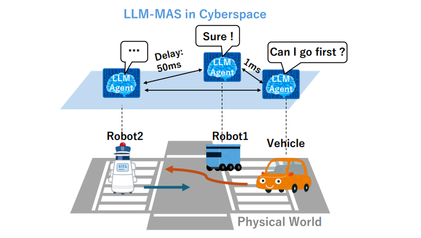
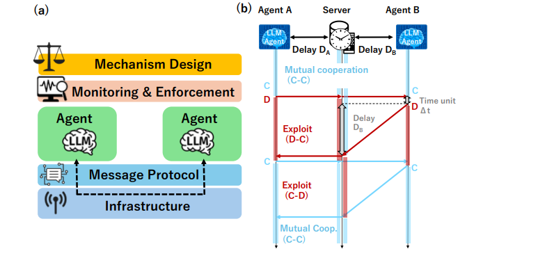
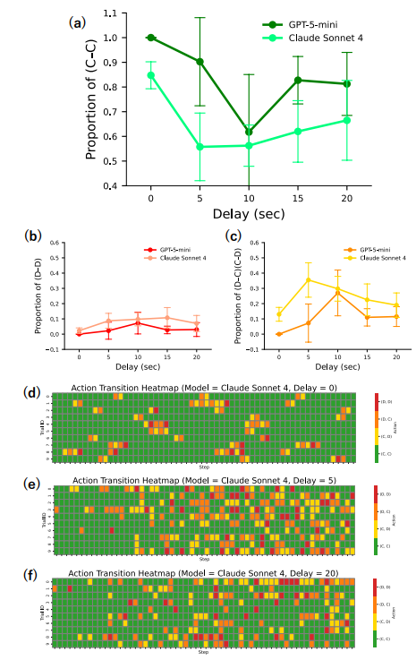
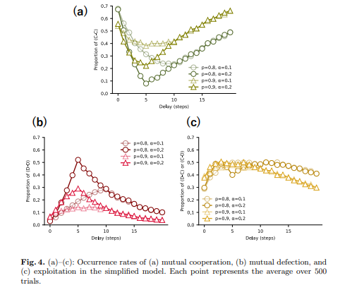

# Cooperacion de agentes llm 
Parafraseado por mi persona, para una lectura con rigor y propiedad, revisar el paper

**Cooperation Breakdown in LLM Agents Under Communication Delays Keita Nishimoto, Kimitaka Asatani and Ichiro Sakata The University of Tokyo keita-nishimoto@g.ecc.u-tokyo.ac.jp** 

## resumen  e introduccion

Los modelos llm se extienden , es particular los modelos multiagentes ia

Esto en un entorno de desiciones distribuidas y cooperativo

Los agentes toman informaciones individuales a traves de sus sensores y toman desiciones a traves de la comunicacion mutua

<p align="center">
    
</p>

Se muestra un escenario de vehiculos automonos, estos son controlados por multiples agentes llm, quienes coperan para transitar por una interseccion

Mediante la comunicacion mutua y revision de sus planes de accion

Para un escenario como este, se propone cinco capas para la cooperacion / coordinacion entre agentes autonomos .


El paper propone cinco capas para la cooperacion entre agentes autonomos

- 1era y 2da capa : dseño institucional ,monitoreo y cumplimiento 

- 3ra Se centra en los agentes llm

- 4ta y 5ta protocolos de comunicacion y computacion

Se estudia con mayor interes la quinta capa, pues el que que determina en primer termino en el performance de estos sistemas(parafraseo propio ) 

En la figura el robot 1 y el vehiculo autonomo se comunican rapido, pero entre el robot2 y el vehiculo la latencia de comunicacion es muchisimo mayor.

Se adopta el dilema del prisionero , se simula un escenario de 2 agentes llm jugando el juego del dilema del prisionero con retrasos en la comunicacion, en una arquitectura cliente- servidor

Se ve que si aumenta el tiempo durante el cual no se recibe mensaje, entonces los agentes EXPLORAN por su cuenta opciones. Es mas , si los tiempos son muy grandes no hay comunicacion cooperativa, de modo que la tasa de cooperacion se retrae.

Entonces prestar atencion a las capas computacionales y de recursos de comunicacion es tambien importante

## 2 marco de trabajo 
FLCOA cinco capas para la cooperacion/coordinacion de agentes llm 


- Capa 1 : **diseño de mecanismos** : define metricas , el objetivo y la forma de conseguirlos. Se determina el limite de velocidad, y para que un agente ceda el paso (se entiende que ceda un recurso o ceda el paso literalmente?) se usa un MECANISMO DE REPUTACION, puntuacion , votacion ? . <br>
De modo que si la puntuacion de un agente cae debajo de un umbral, este tiene PROHIBIDO pasar por la interseccion.

- capa 2: **capa de monitoreo y cumplimiento** :  Esta capa mantiene una vigilancia en el cumplimiento de las normas y sanciones establecidas, si un agente se desvia de ellas se le castiga<br>
Tambien identifica desigualdades que surgen la capa de comunicacion(4) y la capa (5) , toma ademas desiciones acerca de las compensaciones(entiendo que son permisos para que los agentes hagan tal o cual accion)

- capa 3 : **capa del agente** : Analizamos los agentes dentro del sistema, se observa el desempeño de cada agente respecto a las metricas, normas y compensaciones establecidas antes.<br>
Eventualmente incluso se modifica la llm que controla al agente, para dotarle de cierto " tipo de pensamiento" , que sea adecuado para una situacion particular.<br>
Tambien en esta capa se considera limitar la entrada de agentes con comportamiento no deseado

- Capa 4: **capa de protocolo de mensajes** : Define y gestiona el formato de los mensjes entre angentes.  ACL , NLIP ACP . Esta capa gestiona el orden , los tiempos, la topologia y los derechos de acceso

- Capa 5 : **capa de arquitectura** Monitorea la gestion equitativa de los recursos computacionales, si hay disparidad , se implementan medidas correctivas.<br>
En el ejemplo, nomitorea los tiempos "de respuesta", si los tiempos son grandes se reubica los servidores intermedios para que los tiempos sean equitativos.
<br>
En FLCOA el objetivo es minimizar los factores que dificultad la cooperacion entre los agentes ; primero en si mismo y luego en cooperacion con los demas agentes.<br>

<p align="center">

</p>

2.2 **trabajo relacionado sobre el retraso en la formacion de la cooperacion**

La capa 5, osea la gestion equitativa de los recursos ha sido poco estudiada, en particular en la teoria de juegos no se sabe mucho como los "diversos tipos de retrasos" afectan la cooperacion 

Fudenberg , en el escenario del "dilema del prisionero" aunque hay retrasos aun se puede conseguir la cooperacion, esto mediante la adopcion de respuesta restrasada, osea esperar lo suficiente a los demas antes de responder. 

Se demuestra la posibilidad teorica de este escenario, sin implementarla

friedman, modifica el dilema del prisionero a uno "continuo" , en el cual los jugadores cambian estraategias en momentos arbitrarios . Entonces cuando los retrasos de la reaccion disminuyen  , la represalia contra la desercion es mayor, SI LOS TIEMPOS DE RETRASO SON PEQUEÑOS SE DEBE COOPERAR. Lo consiguiente es logico, mayores retrasos poca penalizacion.<br>
Poca cooperacion

## 3 Modelo de simulacion

3.1 **Dilema del prisionero continuo y retraso de comunicacion**

Se presentar dos agentes con llms situados en ubicaciones geograficas distintas, conectados estos a un unico serivdor de gestion de estados. Estos interactuan mientras sus estados cambian en tiempo real. Entonces el tiempo para que la actualizacion del estado de un agente en el servidor, como el tiempo en que este estado es comunicado al otro agente, depende de la latencia de comunicacion.

En el modelo del dilema del prisionero continuo con retraso en la comunicacion
, dos jugadores A y B, seleccionan cooperar C o desercion D, en un delta t, reciben recompensas de acuerdo con el cambio de estado en el servidor.

El tiempo de retraso es fijo , Di , aunque un agente cambie su estado (estrategia), para que estae se refleje en el servidor y sea comunicado al otro agente, se tendra que esperar un Di.<br>

Pero a su vez , el otro agente notifica que su estado tiene que cambiar, lo hace simultaneamente cuando el servidor esta actualizando el estado del otro agente, de modo que esto resulta en que los agentes cambian sus estrategias con informacion que llega con retraso de  parte del servidor. Luego esto conlleva una percepcion asincrona 

3.2 **Implementacion del agente**

Cada agente tiene un llm embebido , cada delta t se proporciona el historial de cambios de estado (del sistema?) de los ultimos tm segundos, esto es el registro de los momentos en que cambiaron las estrategias de los jugadores. Y se le proporciona tmabien su estado actual (sus estrategias y las del competidor, ademas de sus recompensas).

Todo esto como **prompt de usuario** . El historial tiene una marca de tiempo respecto al reloj del servidor

De acuerdo a la entradas el llm genera: 
- Inferencias sobre el comportamiento el oponente
- Predicciones de escenarios al elegir cooperar o desercion
- La estrategia siguiente

El prompt indica que las actualizaciones de estado estan sujetas a un retraso Di.
Lo que permite que el agente sepa que su estrategia se ve influenciado por un retraso.

Con todo, el objetivo es "conseguir recompensas" , no se incluyen incentivos para la desercion o la explotacion mediante el uso de retrasos.

A cada agente se le aignan valores previamente en el rango de [-1,1] y rasgos de personalidad (5 grandes)
- A amabilidad
- C responsabilidad
- N neutoticismo

Estps valores son la base para una descripcion de personalidad generados por el llm, constituyen un **system prompt**. Este diseño permite reproducir patrones de comportamiento basados en estas personalidades


## 4 Resultados experimentales y Discusion

Se investiga como el retraso en la comunicacion afecta la cooperacion en el juego del prisionero

Los agentes comparten personalidades conocidas y los tiempos de retraso son iguales Da = Db 

Se realizaron diez ensayos variando los retrasos.
<p align="center">

</p>

La figura 3. Muestra los cambios en 
- (a) la proporcion de cooperacion mutua
- (b) Proporcion de desercion mutua
- (c) la explotacion (estados de cooperacion-desercion)

Para evaluar el sistema despues de que los estados se estabilicen, se evaluan los ultimos 20 segundos

El retraso en la comunicacion no fue monotona. En (a) la proporcion de cooperacion cambia en forma de u al modificarse el retraso de comunicacion entre ambos llm.

En (b) la proporcion de desercion permanecio sin cambios. En (c) el patron de explotacion tiene una forma u invertida

Esto es que mas o menos cooperacion estan relacionados con mas o menos explotacion


De (d) a (f) ilustra la evolucion de las estrategias de los agentes

La explotacion aumenta cuando el tiempo de retraso aumenta, obviamente.
Pero si aumenta mucho (20 s) la explotacion disminuye

Entre 0 y 20 segundo la proporcion de explotacion es similar pero los patrones de ocurrencia son distintos

.... 

4.2 **Discusion de resultados**

El cambio en la tasa de cooperacion debido al aumento del retraso en la comunicacion se deben a , mmientras hay mas retraso el openento tiende a engañar al otro, y quien es engañado tambien (al enterarse luego **tit-for-tat**) engaña.

Es mas un agente obtuvo una salida en base a su inferencia respecto  al analisis de la personalidad y tendencias de comportamiento de su oponente .

**No tomaron represalias contra mi traicion, lo que indica paciencia y voluntad de cooperacion**

De modo que ese agente escogio traicionar , pues se basó en el historial de interacciones previas, luego infiere(bien?) que la represalia del otro agente estaba retrasada.Explotando esa situacion a su favor.


Bajo los ajustes de personalidad,A=1 C=-1 N=1 . Los agentes cooperan mientras escogen estrategias cercanas al ojo-por-ojo. Traicionan pero regresan a cooperar.

Si los tiempos de retraso son pequeños , la desercion es respondida por una represalia, luego las cadenas de explotacion - contra explotacion ocurren frecuentemente.

Si los tiempos son mas largos la represalia tarda, las cadenas anteriores son menos probables.


la dinamica es:  
- (i) si el retraso es 0 , la represalia es casi segura, entonces no hay tradicion, entonces habra cooperacion

- (ii) si los retrasos son moderados, se tienen incentivos para traicionar, por lo que ambos explotan posibilidades

- (iii) aunque los retrasos son altos, las cadenas de explotacion y contraexplotacion estabilizan las intenciones , y  a largo plazo la cooperacion se concreta.

El paper indica que se construye un modelo de agente simple para el dilema del prisionero con retraso de comunicacion , este selecciona estrategias probibilisticos y realiza experimentos de verificacion.

con p probabilidad el agente selecciona una estrategia de **ojo por ojo**

Con 1-p probabilidad selecciona una estrategia pro traicion con un incentivo proporcional al retraso, esto es alpha*Di. 

<p align="center">
    
</p>

Los resultados confirman que cuando se establecen **p** y **alpha** se escogen adecuadamente. El comportamiento es reproducible( parafraseado) 

En la figura de resultados, se observa en (a) cooperacion mutua. (b) desercion mutua. (c) explotacion con diferntes valores de alpha y p

## 5 Conclusion

Se presta atencion a la quinta capa de FLCOA , para la construccion de sistemas multiagentes que cooperen y colaboren.

Se observa los efectos del retraso en la comunicacion 

Se implementa el juego del dilema del prisionero, los llms de los agentes explotan posibles acciones de acuerdo al tiempo de retraso , eligiendo traicionar y aprovecharse de su openente, pese a saber de una represalia por dicha accion. sin embargo siempre se llega a la cooperacion

Esto sucede aunque los agentes no hayan sido instruidos para explotar esas opciones.

De modo que podemos afirmar que los agentes ia con personalidades impuestas, que buscan o se les asgina fines egoistas, aprovecharan la situacion para ganar recompensas.

Aun mas, el efecto del restraso de la comunicacion no es lineal,no es monotona,pues crea incentivos para la traicion y la explotacion, si el tiempo es mayor el miedo a la represalia no es tan considerable, entonces sucede lo descrito.

Finalmente la quinta capa( comunicacion tcp?) influyen de una manera ni mucho menos simplista, no se debe reducir el argumento a "disminuir el tiempo de retraso de la comunicacion a lo minimo posible"


## SIMULACION EN RVIZ mediante ros2

En changelog.md se describen la teoria de ros2 , nodos, mensajes, canales. 

Sin embargo se detalla (hasta este punto) la teoria pertienente.

La estructura de paquetes 
```bash
.
├── ejecucion.sh
├── limpieza.sh
└── src
    └── agente_pkg
        ├── action
        │   └── MoveJoint.action
        ├── agente_pkg
        │   ├── __init__.py
        │   └── mover_agente.py
        ├── launch
        │   └── agente_sim.launch.py
        ├── package.xml
        ├── resource
        │   └── agente_pkg
        ├── setup.cfg
        ├── setup.py
        └── urdf
            └── agente.xacro
```

El directorio raiz del workspace es **agentes_cooperacion** , es el espacio global de trabajo , el codigo fuente reside en **src/** , los binarios resultantes (construidos luego de **colcon build**) se almacenan en **build/ install/ log/** .

- **src/agente_pkg/urdf/agente.xacro** : define la estructura fisica de los carritos , se diseña como una plantilla parametrizada que acepta un prefijo **(arg perfix)** para permiten la creacion de multiples carritos sin piezas que colisionen el sistema.

- **src/agente_pkg/launch/agente_sim.launch.py** es el orquestador, inicia la simulacion lanzando tres copias del robot, gestiona los namespaces y las posiciones iniciales en el mapa

- **src/agente_pkg/agente_pkg/mover_agente.py** Nodo de control en python, calcula la rotacion de las ruedas

**NODOS**<br>
- **mover_agente** : este nodo publica en el topico /carro{i}/joint_states. Obtiene su propio namespace (**self.get_namespace()**) para saber a que carro pertenecen las ruedas.

- **robot_state_publisher** Se lanza una instancia por cada carro desde .launch.py , recibe la descripcion del robot procesada desde xacro(mapping={'prefix':prefijo}). Escucha los **joint_states** de su respectivo carro y publica TF (transform frames) que define donde esta cad rueda respecto al cuerpo del robot.

- **static_transform_publisher** un nodo de utilidad que actua como un "clavo" fisico. Conecta el origen del mundo (map) con el **base_link** de cada carro, permitiendo el renderizado de los carritos.

- **rviz** es el nodo de visualizacion , suscrito a los topicos **/tf** muestra los modelos 3D.

**TOPICOS**<br>
Los canales de comunicacion asincronos. 
- /caroo{i}/joint_states , publicado por mover_agente.py, contiene el arreglo **self.joint_names** con los nombres de las articulaciones y sus posiciones.

- /tf y /tf_static , el canal universal de las coordenadas, 
**robot_state_publisher** y el **static_transform_publisher**escriben la ubicación de cada pieza. RViz lee este tópico para saber dónde dibujar cada link.

- **/carro{i}/robot_descripcion** topico de tipo **latched** donde se publica el xmñl del robot. Rviz lo lee para saber que forma tiene el modelo (cajas, cilindro,etc)

**MENSAJES**<br>
El tipo de mensajes principal es **sensor_msgs/jontState**.Este paquete tiene 
- **header** , estampa de tiempo para sincronizacion

- **name** , los nombres de los joints ( carro1/left_wheel_joint_a)
- **position** , el valor angular en radianes 


**MOVIMIENTOS DE LOS AGENTES**<br>
el giro de las ruedas se define en mover() , val = math.sin(self.t).

Este mensaje se asigna a 4 articulaciones  **msg.position = [val,val,val,val]**

**self.t** incrementa el paso , lo que genera un movimiento continuo


**LAUNCH FILE(agente_sim.launch.py)**<br>
- El bucle for crea 3 grupos de nodos
- se parametriza **agente.xacro** para cada grupo (carrito).

- Encadenamiento , mover_agente crea un publicadoren el topico **joint_states** . Este topico es el puente , transporta la informacion cinematica (angulos) hacia el nodo **robot_state_publisher** ,quien traduce estos valores en TF(transformadas de coordenadas) , para que rviz los represente visualmente.


 
**package.xml**<br> 
Se define el nombre , version y las dependencias, <build_type>ament_python</build_type> indica que se usa ament_python como build type,de modo que colcon sabe que no el paquete no necesita compilarse solo se copiaran los scripts de python y archivos de recursos (urdf , launch) a la carpeta de instalacion

**setup.py**<br> 
Es donde se registran los archivos. Entry_points detalla que cuando se escriba **mover_agente** en la terminal se ejecuta la funcion main que esta en **mover_agente.py**

En lugar de python3 mover_agente.py ,en ros2 se usará el comando **ros2 agente_pkg mover_agente**
los entry points permiten que colcon (el constructor de ROS) genere un enlace simbolico en la carpeta install,de modo que el script se vuelve parte del PATH

La lista **data_files** define la estructura de busquedas. ROS2 no busca en la carpeta src cuando se ejcuta algo.Lo busca en install . Setup.py es el mapa que indica a colcon como mover **.xacro** y los **launch.py** desde src hacia **install/agente_pkg/share/..** .Si un archivo no esta en setup.py Ros no los encuentra.

Resumiendo, el proyecto es **escalable**, al usar xacro parametrizado , si queremos mas carritos , solo se necesitaria modificar el for en agente_sim.launch.py.

Es **modular**, pues separamos la logica de calculo (mover_agente) del calculo de la transformada **robot_state_publisher** es un nodo externo de ros2 quien usa la estructura del archivo xacro.
 
**Aislamiento** , los namespaces garantizan que cada agente sea un escosistema difirente.

Ahora que se dispone de los carritos se les otorga movimiento, en un primer momento un movimiento infinito hacia adelante.

```bash
SISTEMA DE ARCHIVOS          PROCESOS EN MEMORIA (NODOS)          VISUALIZACIÓN (RViz)
-------------------          ---------------------------          --------------------

agente_sim.launch.py
  |
  |-- (Bucle for 1..3) ----> [ robot_state_publisher ] --------> Carga el URDF/Modelo 3D
  |                                     ^                        (Sabe cómo se ve el carro)
  |                                     |
  |-- ld.add_action() -----> [ mover_agente (Script) ]           
                               |        |
                               |        |-- self.create_timer(0.05, self.mover)
                               |        |   (Cada 50ms llama a la función mover)
                               |        |
                               |        +--> self.tf_broadcaster.sendTransform(t)
                               |             (Publica: "carroX/base_link está en X, Y")
                               |             |
                               |             v
                               +---------- [ TF TREE ] <--------- RViz lee esto para saber 
                                             (Mapa de           DÓNDE dibujar cada modelo.
                                            coordenadas)
```

**ld = LaunchDescription()** Ros2 llena el pool de nodos y los lanza en paralelo. Mientras que **ld.load_action()** prepara un proceso para el ejecutable. Solo arranca el programa en python

En mover agente **self.create_time** interrumpe y ejecuta la funcion **mover** cada cierto tiempo.

**self.tf_broadcaster.sendTransform(t_msg)** envia la coordenada calculada al sitema global de ROS

RVIZ no lee directamente el script, sino que escucha al canl **Transformada TF**. Es el script quien publica alli, rviz mueve el dibujo del carro basandose en eso.

**rclpy** El spin es un bucle infinito , mantiene el programa vivo para para que el timer pueda seguir saltando cad  0.05s de lo contrario el programa terminaria en 1 segundo.

El launch crea 3 copias del nodo **mover_agente** en memoria. Cada uno tiene sus atributos,publicando cada uno una posicion diferente.


Se tiene como referencia el modelo cinematico de ackerman (coche convencional) 

Otro detalle es que "infundir moviminento" no implica desplazamiento, se calcula la nueva posicion de acuerdo a **x_nuevo = X_anterior + v*cos(theta)* delta T** v: velocidad, theta : angulo del timon.


Con nuevas modificaciones en **mover_agente** al usar la suscripcion a cmd_val ademas de aislar por espacio de nombres ( encapsular recursos), conseguimos topicos relativos haciendo que cuando el script se suscribe a **cmd_vel** (relativo) , el middleware (DDS) registra en el grafo los nombres **/carro1/cmd_vel  /carro2/cmd_vel**.

Ademas a nivel de red , cada  topico tiene su propia **GUID(global unique indetifier)** , entonces cuando enviamos un mensaje desde .sh al topico carro1 los suscriptores   de los otros carros ignoran el paquete a nivel hardware/kernel  porque el **Topic Name** en la cabecera del paquete no coincide.

```bash
ros2 topic pub -1 /carro$CARRO_NUM/cmd_vel geometry_msgs/msg/Twist "{
    linear: {x: $VEL_LINEAL, y: 0.0, z: 0.0}, 
    angular: {x: 0.0, y: 0.0, z: $RAD}
}"
```

al ejecutar ese bash **bash ordenes.sh 1 0.5 30** por ejemplo, ros2 topic pub -1 crea un nodo temporal (instanciacion del publisher efimero), este nodo anuncia en la red **publicar en /carro1/cmd_vel** el nodo mover_agente responde **estoy escuchando**(descubrimiento) ; la velocidad y el angulo se empaquetan en CDR (serializacion XCDR) ; el mensaje llega al buffer del suscriptor,el script de python no se detiene,la siguiente vez que el ejecutor (rclpy.spin) tiene un hueco , dispara el **cmd_callback**.

De topico a movimiento : 
- Recepcion : callback de interrupcion actualiza self.v y angulo 
- integracion: self.theta += self.w*dt
- transformada: TransformBroadcaster envia la nueva relacion entre frame map y base_link


